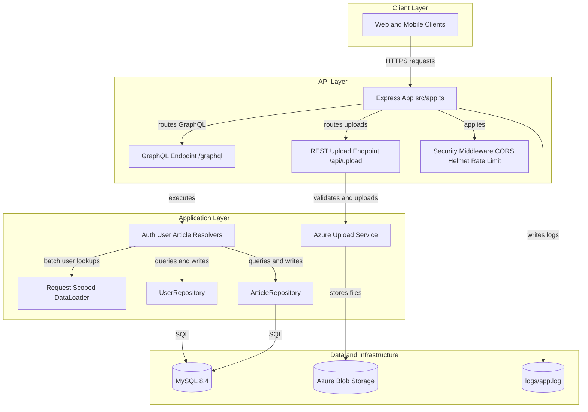
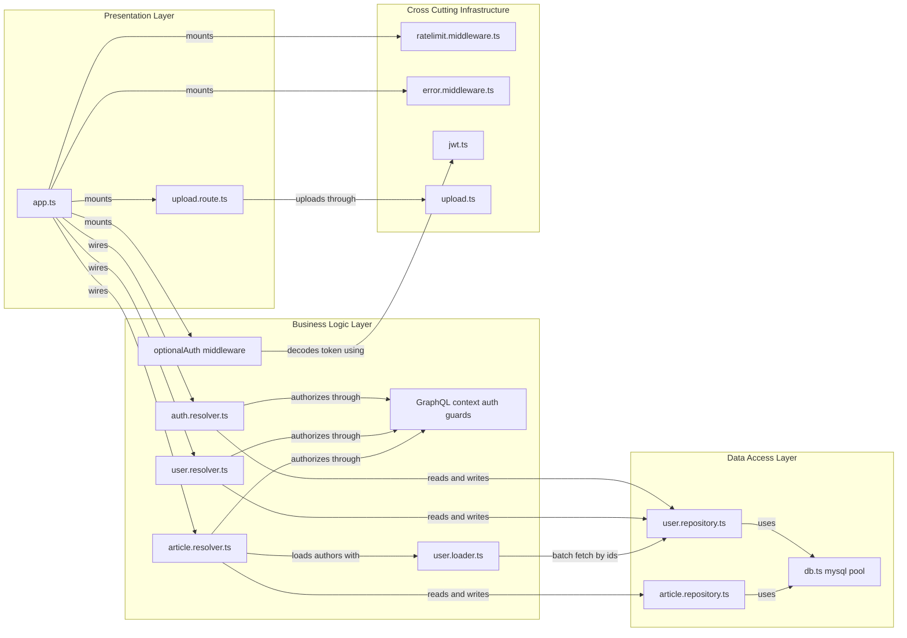

# Uttarakhand Next Backend

A production GraphQL + REST backend for an editorial news platform, built with TypeScript, Express, Apollo Server, and MySQL.

This is the real project backend. We also keep architecture, testing, and delivery practices explicit so the same repository can serve as a transparent showcase of how we work.

---

## Project context: production system and showcase

This codebase is actively used for real product delivery, and also demonstrates:

- how we make architectural decisions and encode them in code
- how we enforce security and operational standards by default
- how we test from units to end-to-end workflows
- how we keep local, containerized, and team onboarding workflows repeatable

If you are evaluating us as a tech partner, you can treat this as both working product code and a representative sample of our engineering discipline.

---

## Product capabilities

- GraphQL API for authentication, users, and editorial article flows
- JWT auth with role-aware access control (author/admin)
- Editorial lifecycle: draft -> pending -> approved/rejected -> resubmit
- Public and privileged article querying
- Trending articles via view tracking
- Image upload endpoint backed by Azure Blob Storage

---

## Tech stack

- Runtime: Node.js 22
- Language: TypeScript (ESM)
- HTTP framework: Express 5
- API layer: Apollo Server 5 + GraphQL
- Database: MySQL 8.4
- Auth/security: JWT, bcrypt, helmet, CORS, express-rate-limit
- Logging: Winston (console + file transports)
- Testing: Jest, Supertest, Testcontainers, Newman
- Containerization: Docker + Docker Compose

---

## Quick start (Docker)

### Prerequisites

- Docker Desktop (or Docker Engine + Compose)
- Docker daemon running

### Start the stack

```bash
cd un-backend
docker compose up --build
```

If you need a clean database re-initialization:

```bash
docker compose down -v
docker compose up --build
```

### Endpoints

- API base: `http://localhost:4001`
- GraphQL: `http://localhost:4001/graphql`
- Health: `http://localhost:4001/health`

---

## Local development (without Docker)

```bash
npm install
npm run dev
```

Then run against your own MySQL and `.env` configuration.

> Note: This repository does not include a committed `.env.example`. Create `.env` manually using the variable list below.

---

## Required environment variables

These are read by the app (`src/config/env.ts`) and related modules:

- `PORT`
- `NODE_ENV`
- `DB_HOST`
- `DB_PORT`
- `DB_USER`
- `DB_PASSWORD`
- `DB_NAME`
- `JWT_SECRET`
- `JWT_EXPIRES_IN`
- `JWT_REFRESH_SECRET`
- `JWT_REFRESH_EXPIRES_IN`
- `CORS_ORIGIN`
- `RATE_LIMIT_WINDOW_MS`
- `RATE_LIMIT_MAX`
- `AZURE_STORAGE_CONNECTION_STRING`
- `AZURE_CONTAINER_NAME`
- `FILE_CREATION_SECRET_KEY`

Optional:

- `LOGS_DIR` (defaults to `<project-root>/logs`)

---

## System architecture

### Runtime flow

```text
Client
  -> Express app (src/app.ts)
     -> Security middleware (CORS, Helmet, Rate Limit, JSON limits)
     -> Optional JWT decode middleware
     -> GraphQL endpoint (/graphql) + REST upload endpoint (/api/upload)
        -> GraphQL resolvers / upload handler
           -> Repository layer (parameterized SQL)
              -> MySQL
           -> Azure Blob Storage (for images)
```

### Architecture diagram (high level)



### Component relationship diagram



### Code organization

```text
src/
  app.ts
  config/               # environment and runtime configuration
  database/             # DB pool + SQL bootstrap scripts
  graphql/
    schema/             # GraphQL SDL files (*.gql)
    resolvers/          # auth, user, article resolvers
    loaders/            # DataLoader for N+1 prevention
    context.ts          # auth helpers + typed GraphQL context
  middleware/           # auth, error, rate limit
  models/               # typed domain models/interfaces
  repositories/         # DB access and query composition
  routes/               # REST routes (upload)
  types/                # pagination + editorial constants
  utils/                # error, jwt, logger, upload, response
```

---

## Architectural decisions (ADR summary)

### ADR-01: GraphQL-first API with modular schema loading

- Decision: Use GraphQL as the primary API and load/merge schema and resolvers modularly.
- Evidence: `src/graphql/loaders/graphql.loader.ts`, `src/graphql/schema/*.gql`.
- Why: Keeps domain contracts explicit, discoverable, and easier to evolve by module.
- Trade-off: Requires resolver discipline for auth and error mapping.

### ADR-02: Hybrid transport (GraphQL + REST)

- Decision: Keep most business operations in GraphQL, but use REST for multipart file upload.
- Evidence: `/graphql` in `src/app.ts`, `/api/upload` in `src/routes/upload.route.ts`.
- Why: GraphQL handles domain workflows; REST handles file streaming ergonomically.
- Trade-off: Two interface styles to maintain.

### ADR-03: Stateless auth with resolver-level authorization

- Decision: Decode JWT opportunistically in middleware, enforce access in resolvers/context helpers.
- Evidence: `optionalAuth` middleware + `requireAuth`/`requireAdmin`.
- Why: Per-operation authorization is explicit and testable.
- Trade-off: Resolver authors must consistently apply auth helpers.

### ADR-04: Repository pattern over direct SQL usage in resolvers

- Decision: Encapsulate all DB operations behind repositories with typed models.
- Evidence: `src/repositories/*.ts`.
- Why: Centralized SQL, easier testing, and clear data-access boundaries.
- Trade-off: Slightly more boilerplate than inline query usage.

### ADR-05: Use `neverthrow` in data and utility boundaries

- Decision: Return typed `Result` objects from repositories and upload utilities.
- Evidence: `ok/err` patterns in repositories and `src/utils/upload.ts`.
- Why: Makes failure paths explicit and reduces hidden exception behavior.
- Trade-off: Additional unwrap/branch logic at call sites.

### ADR-06: Structured domain error taxonomy

- Decision: Maintain categorized error codes and map them to GraphQL and REST responses.
- Evidence: `src/utils/error.ts`, `src/utils/response.ts`.
- Why: Consistent client behavior and easier debugging/observability.
- Trade-off: Requires disciplined error catalog maintenance.

### ADR-07: Cursor-based pagination for list APIs

- Decision: Implement Relay-style cursor pagination (`first`, `after`) across user/article lists.
- Evidence: `src/types/pagination.ts`, repository `findPaginated` methods.
- Why: Stable pagination under changing datasets; scales better than offset-only patterns.
- Trade-off: Slightly more client complexity.

### ADR-08: Request-scoped DataLoader for N+1 control

- Decision: Create DataLoader per request and place in GraphQL context.
- Evidence: `src/graphql/loaders/user.loader.ts`, context creation in `src/app.ts`.
- Why: Batching and caching user fetches in nested article->author queries.
- Trade-off: Must preserve per-request loader lifecycle.

### ADR-09: Domain taxonomy validation at application layer

- Decision: Validate editorial sections/subsections in code using canonical constants.
- Evidence: `src/types/article.constants.ts`, checks in article resolvers.
- Why: Keeps business constraints explicit and consistent before DB writes.
- Trade-off: Requires synchronization with product taxonomy changes.

### ADR-10: Security defaults in middleware pipeline

- Decision: Apply helmet, CORS policy, rate limiting, payload limits, and authenticated upload route.
- Evidence: `src/app.ts`, `src/middleware/ratelimit.middleware.ts`, `src/routes/upload.route.ts`.
- Why: Baseline hardening out of the box.
- Trade-off: Must tune limits/policies per deployment environment.

### ADR-11: File + console logging for local and container operability

- Decision: Write logs to console and `logs/app.log` via Winston.
- Evidence: `src/utils/logger.ts`.
- Why: Real-time container logs + persistent local troubleshooting.
- Trade-off: Needs log rotation/storage strategy in production environments.

### ADR-12: Containerized local parity and deterministic DB bootstrap

- Decision: Compose app + MySQL with health checks and startup SQL scripts.
- Evidence: `docker-compose.yml`, `src/database/01-tables.sql`, `src/database/02-seed.sql`.
- Why: Fast onboarding and reproducible environments across machines.
- Trade-off: Requires Docker runtime availability.

---

## Testing strategy

Testing is a first-class part of delivery in this project. We use layered tests so each change is validated at the right depth.

### What our tests protect

- authentication and authorization boundaries (author vs admin permissions)
- editorial workflow transitions (draft, pending, approved, rejected, resubmit)
- data access correctness (SQL queries, filtering, pagination, counts)
- API behavior and error contracts
- utility correctness (JWT, pagination cursors, DataLoader batching and caching)

### Test layers and scope

| Layer | Tooling | What we validate | Representative files |
| --- | --- | --- | --- |
| Unit | Jest | Pure logic and helper behavior | `src/utils/jwt.test.ts`, `src/types/pagination.test.ts`, `src/graphql/loaders/user.loader.test.ts` |
| Repository | Jest + Testcontainers + MySQL | Real SQL behavior against ephemeral MySQL | `src/repositories/user.repository.test.ts`, `src/repositories/article.repository.test.ts` |
| GraphQL integration | Jest + Apollo Server + Supertest + Testcontainers | End-to-end resolver behavior, auth rules, workflow transitions | `src/__tests__/integration/auth.test.ts`, `src/__tests__/integration/user.test.ts`, `src/__tests__/integration/article.test.ts` |
| Scenario and E2E-style | Newman (Postman collection) | Real client-like flows with report output | `tests/collection.json`, `tests/run-tests.sh`, `tests/run-tests.bat` |

### How we execute tests during delivery

1. Run unit tests for fast feedback while implementing.
2. Run repository and integration tests to validate real database and API behavior.
3. Run Newman collection for scenario-level confidence when preparing releases.
4. Merge only after lint, test, and build checks are clean.

### Test artifacts

- Collection: `tests/collection.json`
- Environment: `tests/environment.json`
- Runners: `tests/run-tests.sh`, `tests/run-tests.bat`
- Generated report: `tests/test-report.html`

---

## Running quality checks

> Note: repository and integration tests rely on Testcontainers and require a running Docker daemon.

```bash
# lint
npm run lint

# full jest suite
npm test

# targeted jest suites
npm run test:unit
npm run test:integration

# compile
npm run build
```

For Postman/Newman scenario tests:

```bash
cd tests
./run-tests.sh
```

Windows:

```bat
cd tests
run-tests.bat
```

---

## Operational notes

### Health and root endpoints

- `GET /health` returns status + timestamp
- `GET /` returns a basic service-running message

### Logs

- Container logs: `docker compose logs -f un_backend`
- App log file: `logs/app.log`

### Upload constraints

- route: `POST /api/upload`
- auth: requires `Authorization: Bearer <token>`
- max size: 5 MB
- mime types: jpeg/png/gif/webp

---

## How this reflects our consultancy delivery model

Because this is production code, it reflects how we execute projects in practice:

1. **Architecture with intent**  
   Decisions are explicit, not accidental.

2. **Security as a baseline, not a phase**  
   Auth, RBAC, payload controls, and rate limiting are built in from day one.

3. **Test strategy by risk layer**  
   Unit, repository, integration, and scenario testing are all represented.

4. **Operational readiness from the start**  
   Health endpoints, structured errors, and logs are included early.

5. **Reproducible engineering workflows**  
   Dockerized setup and documented runbooks reduce onboarding friction.

---

## Contribution workflow

1. Create a feature branch
2. Implement changes with tests
3. Run lint + tests locally
4. Open a PR with clear scope and rationale

Commit prefixes:

- `feat:`
- `fix:`
- `docs:`
- `refactor:`
- `test:`
- `chore:`

---

## License

This code belongs to basictech.
